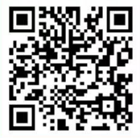
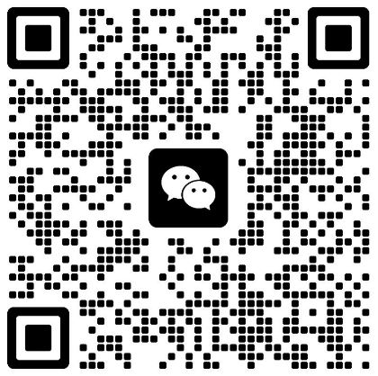

# Event Preview | WKU's First Host Competition Auditions Registration

WKU Art Troupe 2024-09-27 18:00

Wenzhou-Kean University's First

**Host Competition**

**2024**

**Wenzhou-Kean University**

**TIME: October 27th 19:00 - 21:00**

**ADD:** Business School C135

## Overview

**"The passion in front of the microphone never fades."**

In this beautiful autumn season of knowledge harvest, Wenzhou-Kean University's Student Party Building Studio, WKU Art Troupe, and Campus Radio Station jointly present WKU's First Host Competition, bringing a talented and meaningful hosting event.

This competition aims to further promote the Party's values, discover and develop campus hosting talents, and serve as a comprehensive event for talent display, skill enhancement, cultural exchange, and public participation. Through the unique on-the-spot performances of the hosts, we hope to convey the responsibilities of the young generation and promote positive energy to guide society. At the same time, by providing this platform for cultural exchange and public engagement, we strengthen the connection between the Party and the people and inspire love for the Party and country among students, striving for the realization of the great rejuvenation of the Chinese nation.

## 01 Competition Plan

**Event Name:**

Wenzhou-Kean University's First Host Competition

**Participants:**

All students

**Number of Participants in Semi-finals:**

Contestants who pass the audition (15 participants)

**Event Time:**

October 19th, Evening 18:30 - 21:00

**Event Location:**

Business School C135

**Number of Participants in Final:**

Contestants who pass the semi-finals (10 participants)

**Event Time:**

October 27th, Evening 19:00 - 21:00

**Event Location:**

Business School C135

The competition is divided into two phases: auditions (preliminary) and finals. The preliminary round will be conducted online. Contestants must record their videos and send them to the designated email before 23:59 on October 12th according to the competition requirements. The list of participants for the semi-finals will be announced from October 13th to 15th. The offline semi-finals will be held on the evening of October 19th from 18:30 to 21:00, and the outstanding contestants will advance to the finals.

## 02 Audition Rules

The preliminary round will be conducted online. Contestants need to fill in the registration form and send a video to the official email **sccc@wku.edu.cn**. The video should include: a 1-minute self-introduction + Mandarin test + 2-minute prepared speech (details of the Mandarin test and prepared speech topics are attached in the email).

## 03 Semi-final Rules

**01 Semi-final Round 1**

**Manuscript Reading**

Contestants will receive the manuscript reading topic pool in advance. They will randomly draw a manuscript from the pool for reading on-site.

**02 Semi-final Round 2**

**Sentence Formation or Tongue Twister**

Tongue Twisters and Sentence Formation (choose one) (two minutes)

Choose "Tongue Twister": Numbers from 1 to 14 will randomly appear on the screen. Each contestant will choose a number, behind which there will be a tongue twister. The contestant must read the tongue twister within two minutes, and each one can only be read once without repetition.

Choose "Sentence Formation": Numbers from 1 to 14 will randomly appear on the screen. Each contestant will choose a number, behind which there will be a group of words. The contestant must use these words to form a complete sentence, using all the words provided.

## 04 Final Rules

**01 Final Round 1**

**120 Seconds Word Fill-in**

Contestants will draw a topic on-site and fill in the blanks within 120 seconds for impromptu hosting. For example: "Take **\_\_**, let's go!" Contestants must complete a hosting segment on the given topic within 120 seconds.

**02 Final Round 2**

**150 Seconds Tic-Tac-Toe Speech**

Nine words will appear on the screen. Contestants must choose three words that can form a line, using them as keywords to deliver a two-and-a-half-minute impromptu speech.

## 05 Event Benefits

Contestants who enter the semi-finals will receive **5 hours** of volunteering time for cultural and sports activities. Contestants who enter the finals will receive **10 hours** of volunteering time (semi-final and final hours are not cumulative). Winners will receive additional surprise gifts.

## 06 Registration Method

The competition registration is done through **filling out a form + sending a video**, with the deadline being **23:59 on October 12th, 2024**. We encourage all WKUers who love hosting and are willing to showcase their talents to participate! Below is the registration QR code:

(Registration QR code)

Participants who have filled in the registration form should join the audition group and change their group note to **Chinese Name + Year**. Please pay close attention to the messages in the group. The final list and subsequent notifications will be published in the group.

(Audition group QR code)

![](255859e
