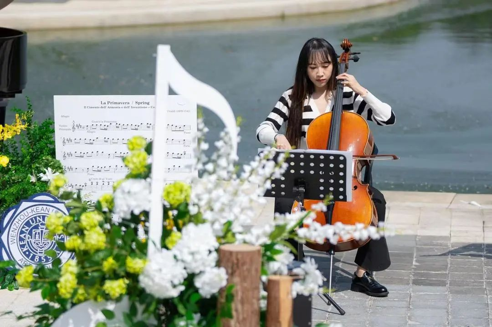
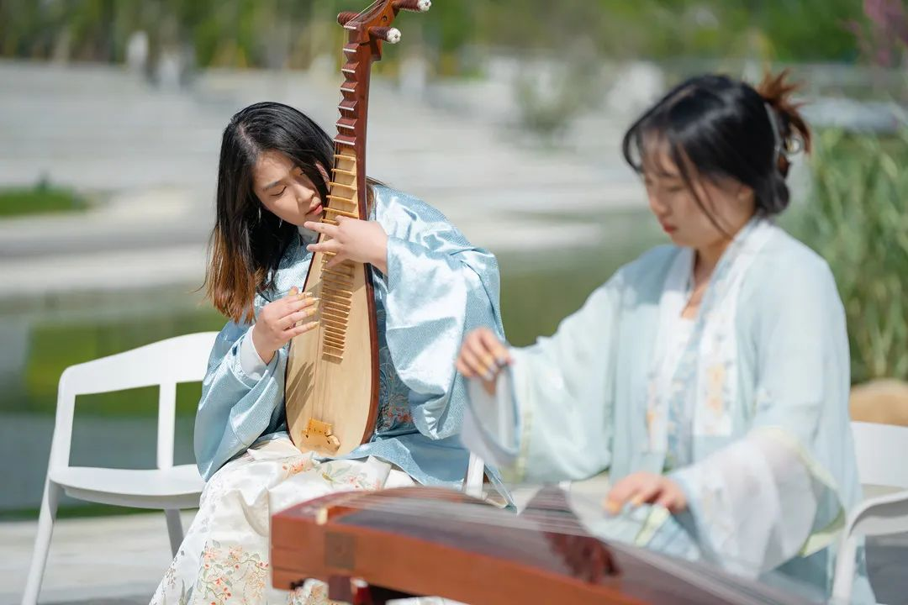
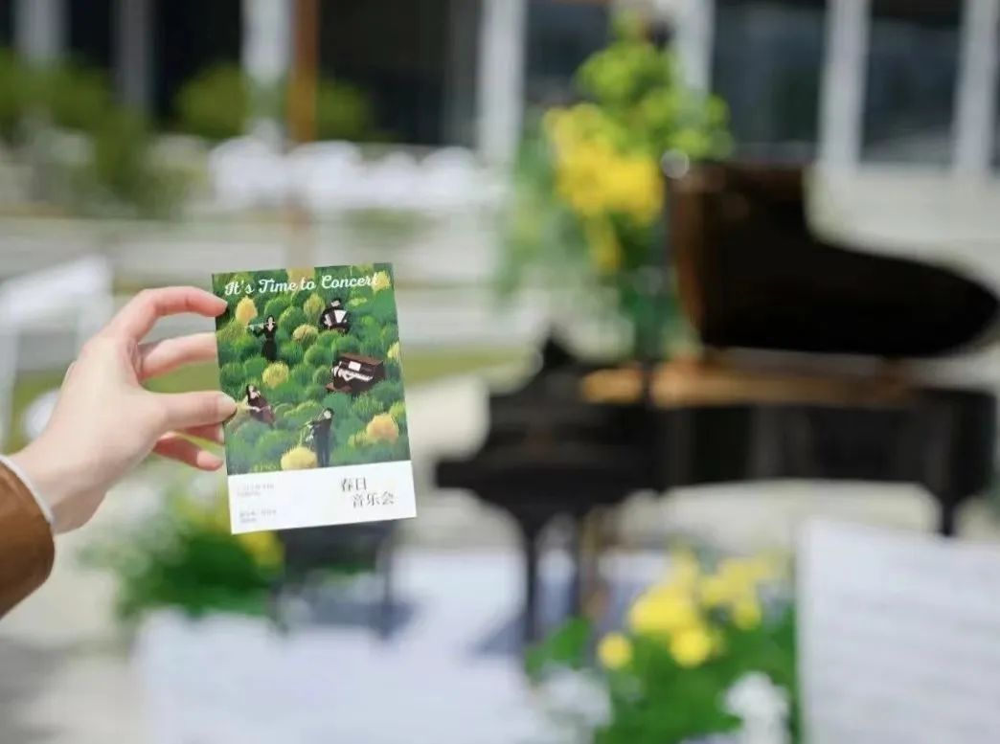
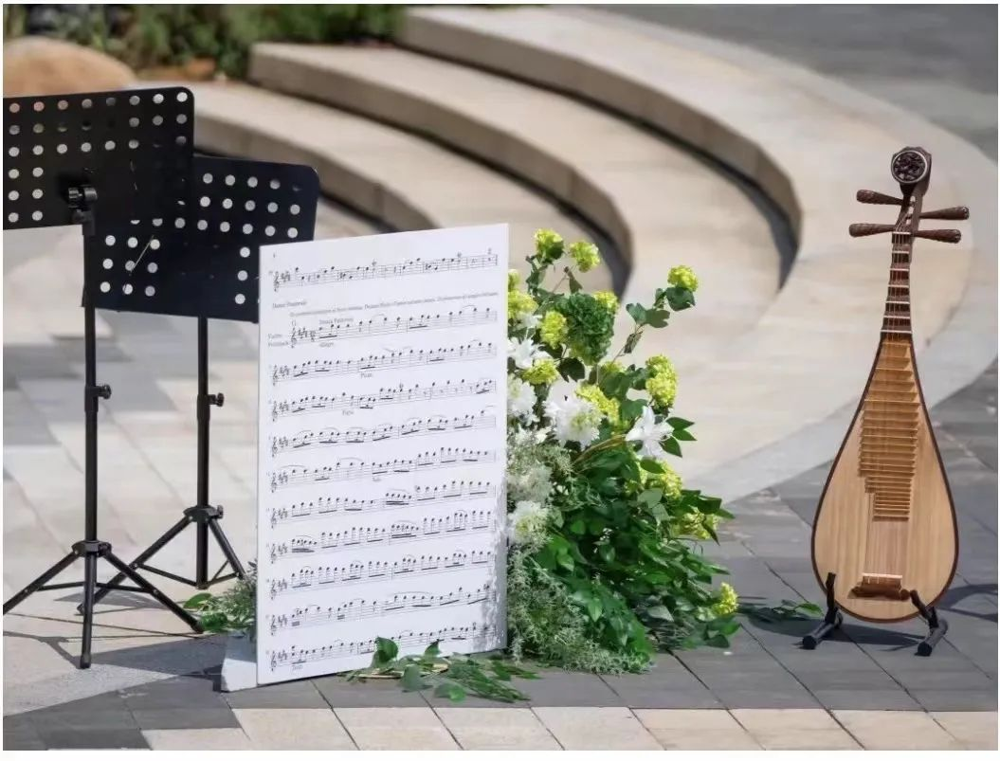
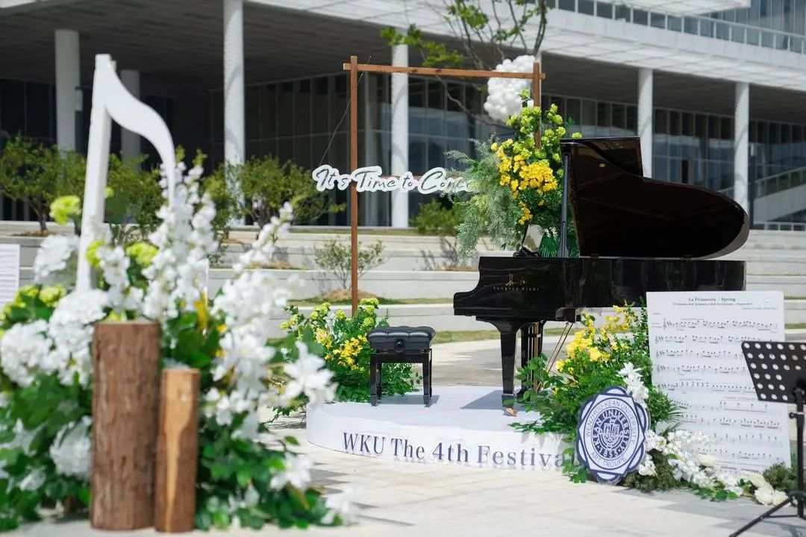
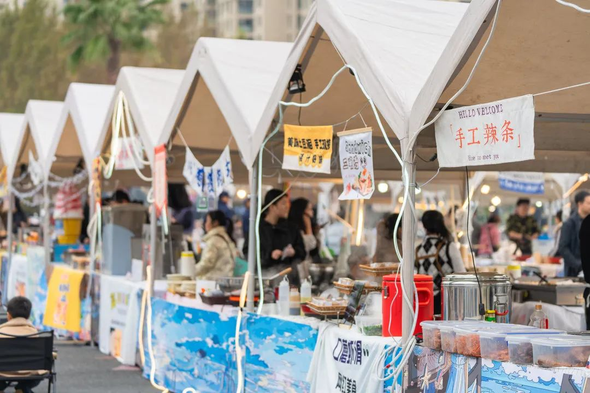
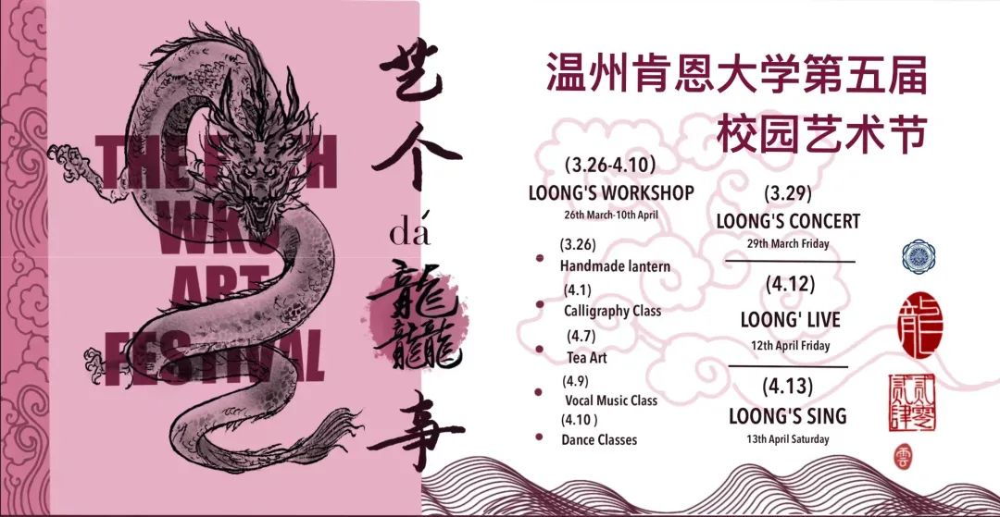

# Loong's Concert | Awaken the Spring Melody - A Lakeside Spring Concert
WKU Art Troupe 2024-03-28 19:56

As the spring breeze gently caresses the lakeside, we sincerely invite you to join us on a wonderful journey of melody. In this season full of vitality and hope, we will build a musical hall by the central lake on campus, playing melodious pieces for you.

## Lakeside Spring Scenery

### The Charm of Music: Spring Concert

**[2024/03/29]**  
**[Friday 14:30]**  
**[Central Lake beside SLAC]**

The strings of the orchestra sway gently, seemingly dancing with the spring breeze; the ancient instruments of the traditional Chinese music ensemble interpret the soul of Chinese music, immersing you in long-lasting melodies; the choir's voices are like heavenly music, presenting you with a symphony for the soul. Additionally, there will be a special vocal ensemble that will bring you unexpected surprises.

## SPRING CONCERT

### The Wonderful Fusion of Nature and Music

The spring concert will be held by the lakeside.

Enjoy the spring sunshine in the beauty of music.

Feel the mystery and beauty of nature.

With the lake and mountains as the backdrop, accompanied by melodies,

Let every breeze of spring carry away your fatigue.

## Eye-Catching Highlights

### Exciting Booths Await You

Besides the exciting live performances, we also provide a variety of booth experiences! At the booths, you can admire artwork and receive small gifts.

Let us all immerse ourselves in the beauty of spring melodies and experience the wonder of music together! Let music bloom in the spring breeze, share the lakeside spring scenery with you, and spend this musical spring together!

For more series of activities, please follow the Art Troupe's official account and emails.

The "Art Affairs" Art Festival welcomes everyone who loves art!

