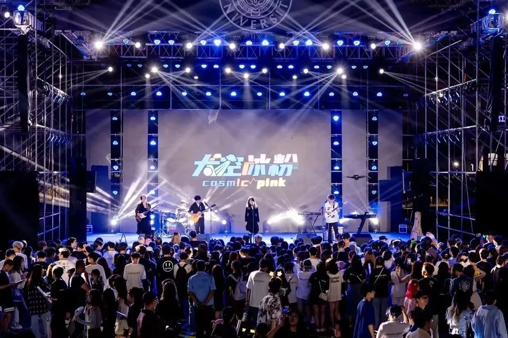
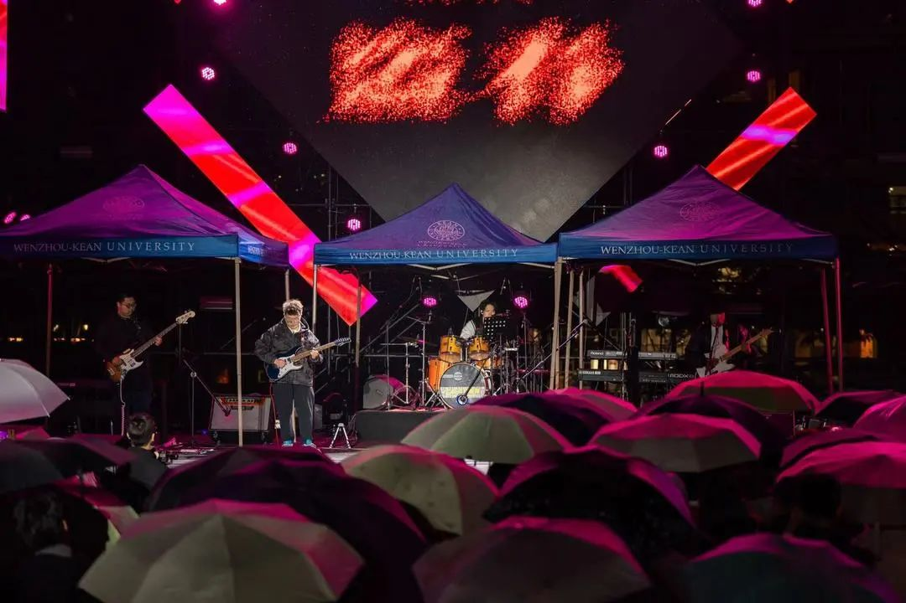
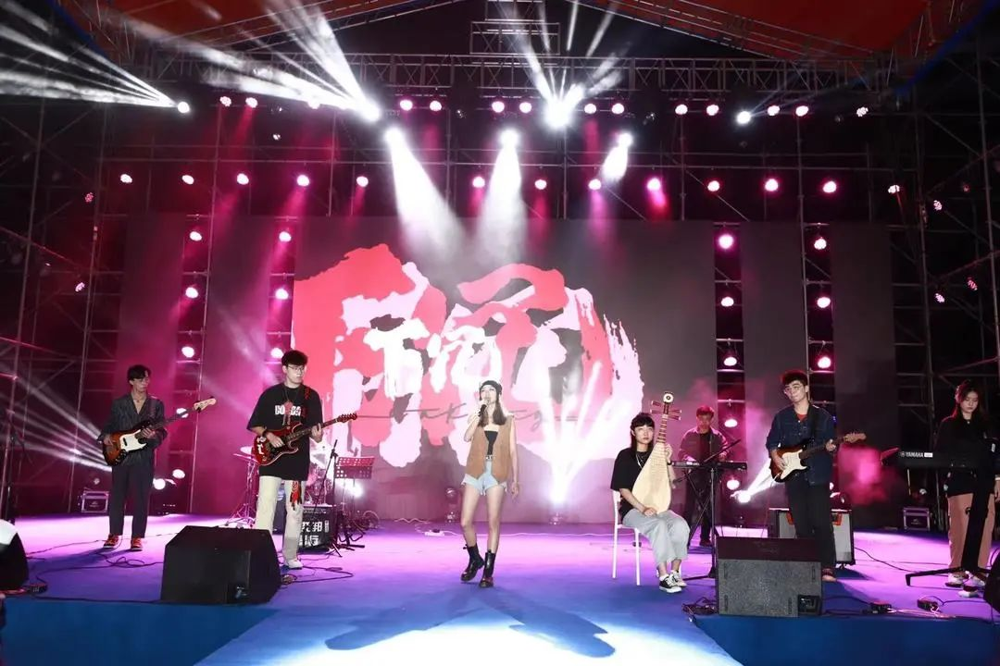
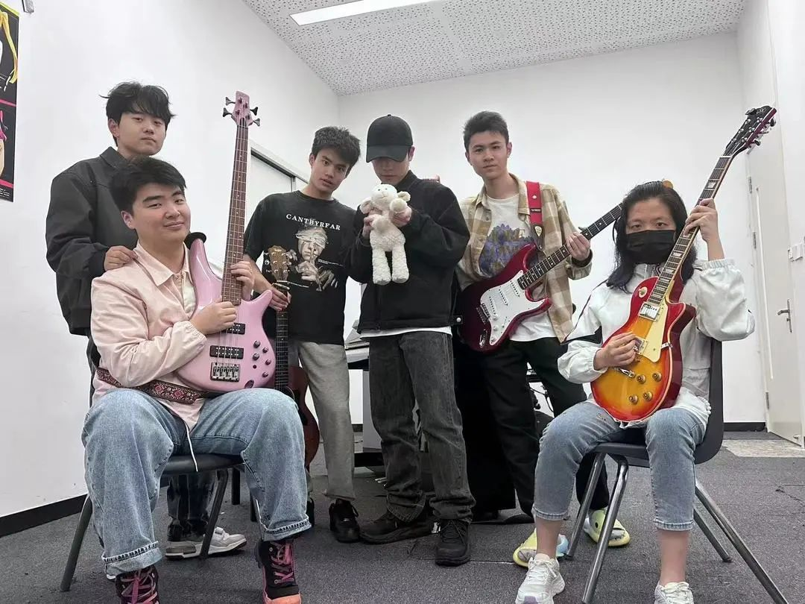
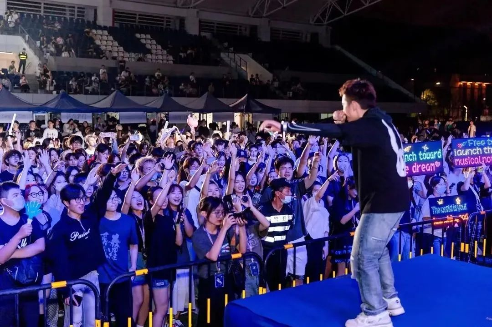
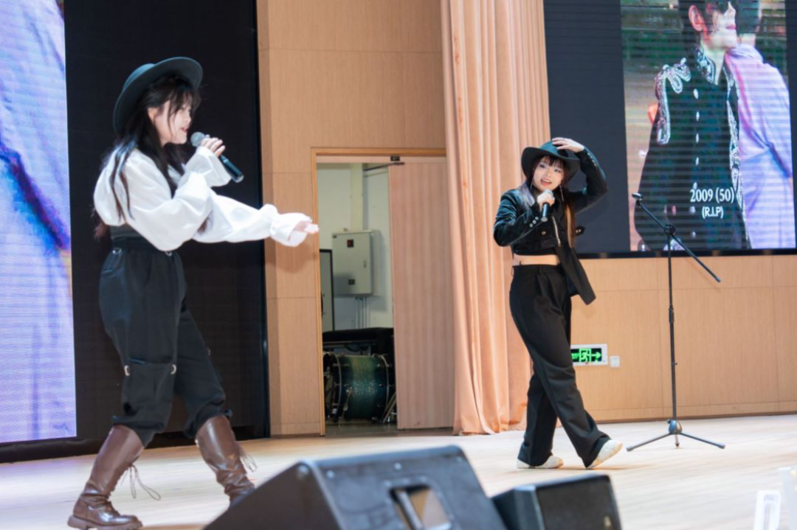
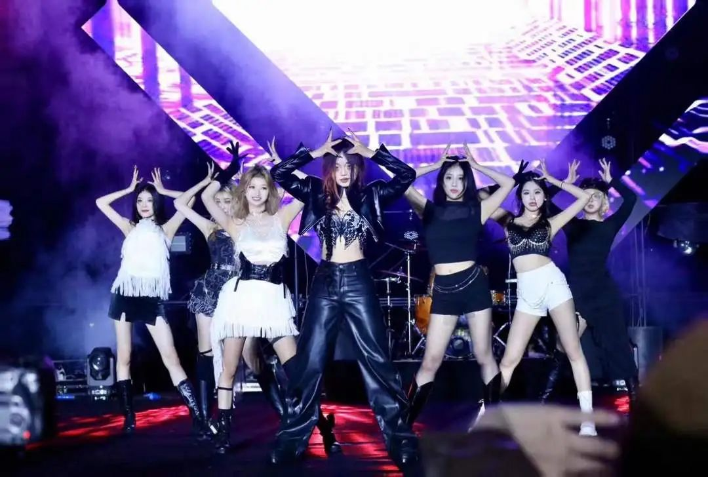

# Loong's Live | A Romantic Summer Night on Friday
WKU Art Troupe 2024-05-09 18:52

It is the long-missed summer night breeze

It is the warm night we spend together

It is the long-awaited reunion

The connection between people, music, and nature

Is ever-changing

Yet often creates unforgettable beautiful experiences

## LIVE

Finding an outlet for oneself amidst fragmented emotions

Music gathers us together

We are as small as stardust, yet as abundant as the universe

**Life goes on, and so does the music**

**This Friday, we meet again**

## Loong's Live

### Performance Lineup

**/Space Ice Jelly/**

It's like a long, damp dream

Founded in the summer of 2021 in Wenzhou

Loves indie rock and the feeling of emptiness

Perhaps, if possible, would rather go to space and eat ice jelly

**/Steal Spring/**

Stealing the spark of spring

Igniting the barren land of unknown ideals

We tirelessly chase the sun, moon, and stars

But we never chase time

So we are forever young

**/The Sinking Age/**

Open the window, lift the telescope

Follow us to see rose petals

Falling quietly amidst the frenzy of a spring thunderstorm

Go wild and laugh with the confused youth

When that crazy song plays again...

**/7 AM/**

"Have you ever seen WKU at 7 AM?"

There is no standard answer

Life is as unrestrained as music

Follow our rhythm

And revel until [7 AM]

**/RAP Team/**

The madness of midsummer

Along the path of happiness

Under the starry sky, hearts entangled with disputes, yearning for peace

In chaos, whispers of love long for eternal tranquility

The RAP Team will bring you an explosive performance

**/Top Ten Singers/**

Three outstanding singers from the Top Ten Singers

Will interpret different music stories with their unique voices

Each style will bloom with unique brilliance on stage

Every note will be a touch on the soul

**/Street Dance Club/**

Heartbeat resonating with the drumbeat

Dance and music in perfect harmony

"Jump" into the sound waves

"Dance" out the beauty of the summer night

Let the WKU Dance Club take you

To enjoy a stage filled with infectious energy

**/DJ Party/**

A super live performance combining hip-hop, K-pop, pop, and rock

Will be presented as scheduled

With two talented DJs from the freshmen class—Benz & Neo

## Loong's Live

### Event Information

**/Time/**

Friday, May 10

18:30-21:40

**/Location/**

Lawn beside the teaching building

**/More Information/**

Scan the code to join the audience group

### TIPS

Inflatable sofas will be provided for front-row audience members at the LIVE site

Limited quantity, first come, first served

**LIVE**

**Looking forward to meeting you again**

**For a romantic summer night**

**♥**

