# Loong's Workshop | The Collision of Cultural Integration - Each One a Unique Artistic Experience

WKU Art Troupe 2024-05-21 20:53

Art is a bridge

Connecting different cultures, ideas, and emotions.

It transcends language barriers

Allowing us to find resonance deep in our hearts.

In this dragon-themed event,

We held a series of workshops

To allow participants to experience this ancient and magical theme firsthand.

From **handmade lanterns** to **paper cutting**,

From **calligraphy** to **tea art** and **vocal music**,

Each one was a unique artistic experience,

Letting us explore the legend of the dragon

And feel the charm of art.

## 1. Art Workshop Series: Calligraphy Appreciation

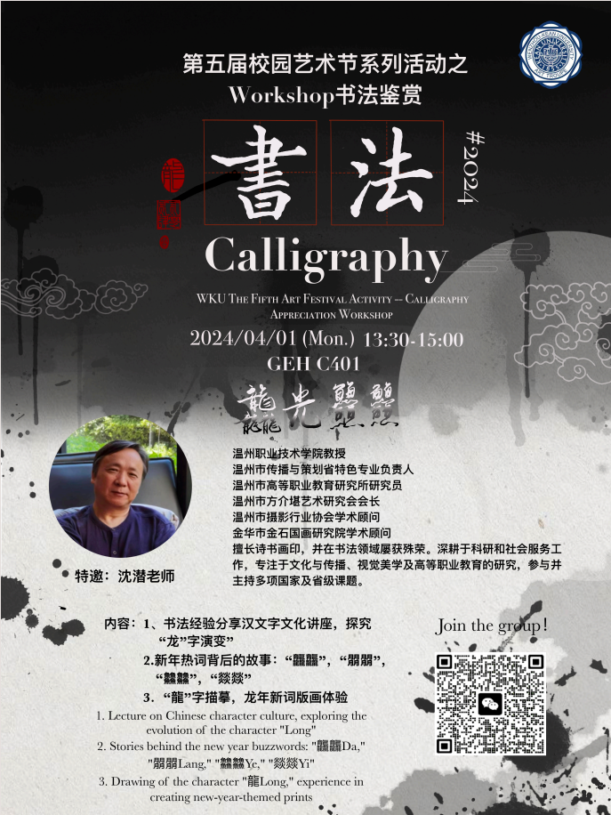

**/Guest Speaker/**

**Mr. Shen Qian**

For the "Dragon Light Dragon Dragon" Calligraphy Appreciation workshop, we invited **Mr. Shen Qian** to hold a Chinese calligraphy appreciation event for our students and Chinese and foreign faculty and staff.

The event specially incorporated the cultural theme of the Year of the Dragon. By using the symbolic meaning of luck, authority, and nobility, the workshop allowed students and faculty to experience the charm and profound heritage of traditional culture through the art of calligraphy.

Mr. Shen shared his calligraphy experience and gave a lecture on Chinese character culture, exploring the evolution of the character "龙" (dragon) and the stories behind the new year buzzwords: "龘龘," "朤朤," "䲜䲜," and "燚燚." Teachers and students jointly traced the character "龙" and experienced the printmaking of new dragon-themed words.

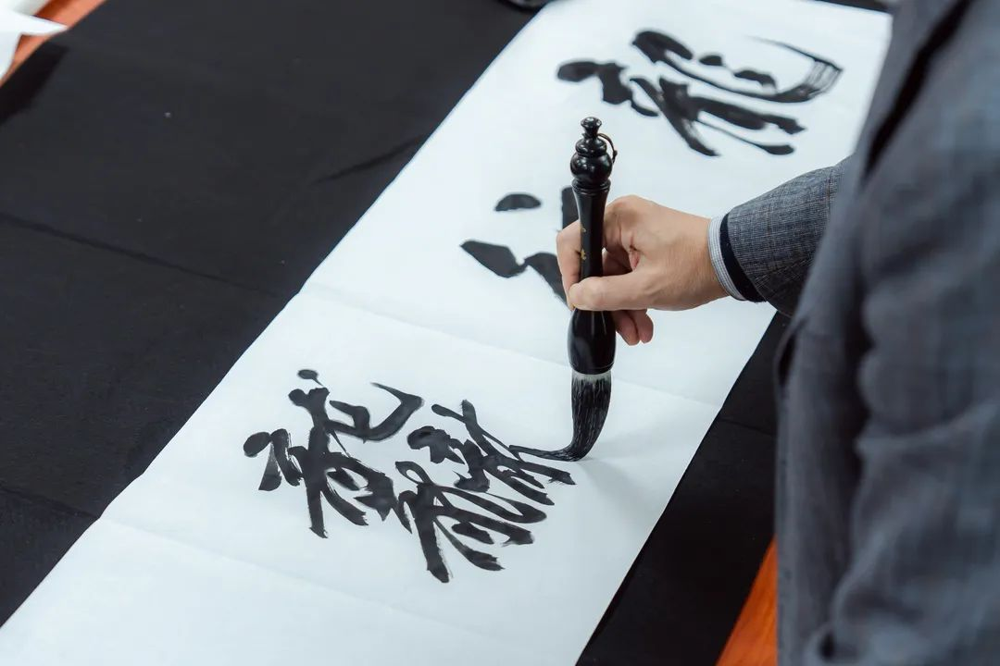

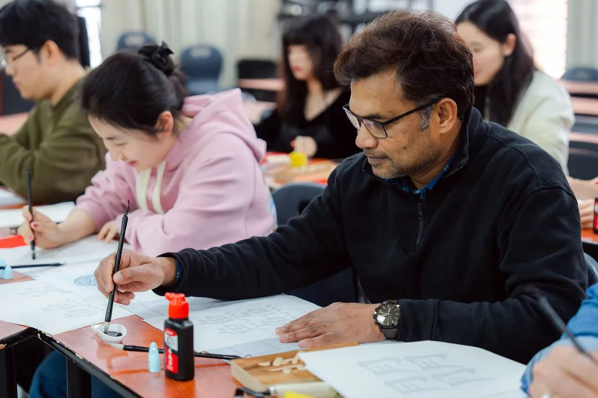

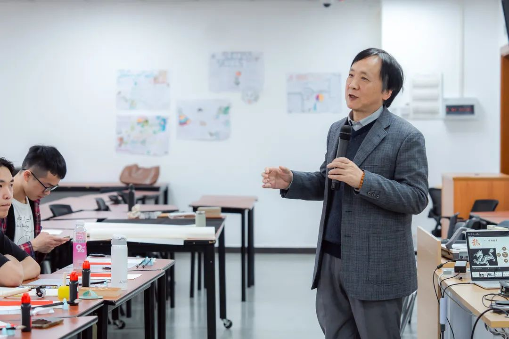

## 2. Art Workshop Series: Song Dynasty Tea Ceremony

**/Guest Speaker/**

**Ms. Chen Xiaoqian**

The life of literati in the Song Dynasty included four arts: tea ceremony, incense burning, flower arrangement, and hanging paintings.

Among them, the first is the tea ceremony. The action of whisking and striking is intricate yet romantic, with a good outcome described as, "Green clouds are blown continuously by the wind, and white flowers float, condensing on the surface of the bowl." Patterns could be painted on well-whisked tea, which could be appreciated as art or simply enjoyed as a drink.

In this tea art workshop, under the guidance of **Ms. Chen Xiaoqian**, students and teachers learned about the culture of the tea ceremony and its historical origins. They learned the steps and techniques of the tea ceremony and completed their own tea creations, experiencing the elegance of the Song Dynasty.

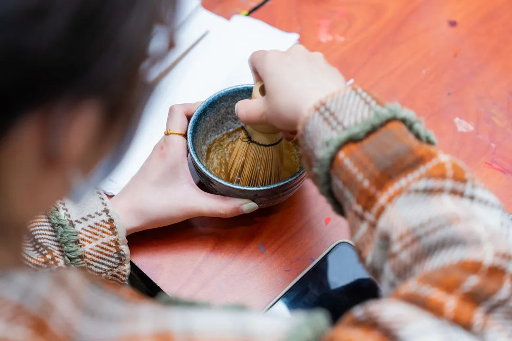

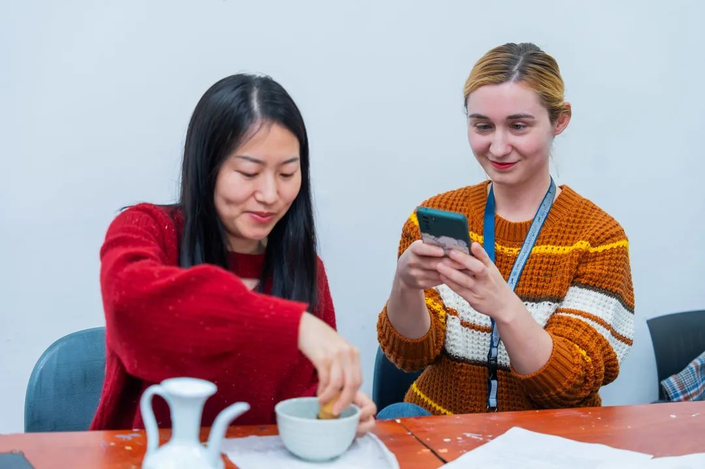

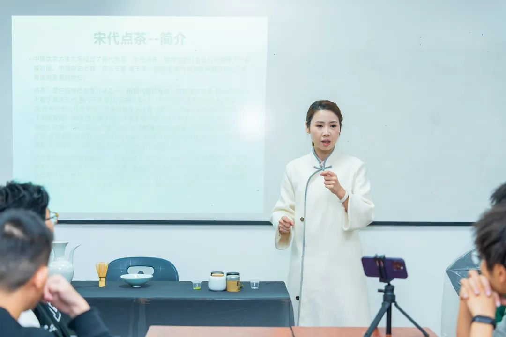

## 3. Art Workshop Series: Handmade Lanterns

**/Guest Speaker/**

**Mr. Zhu Ming**

Lantern-making is an important part of traditional Chinese culture. In this handmade lantern workshop, under the guidance of **Mr. Zhu Ming**, participants designed their own dragon-themed lanterns.

By making their own lanterns, participants showcased their design talents. Some of these lanterns truly reflected the unique charm of this art. Each lantern was filled with stories and emotions, brimming with the creativity and ideas of its creator, deepening our love and respect for traditional culture. We look forward to more art festival activities in the future!

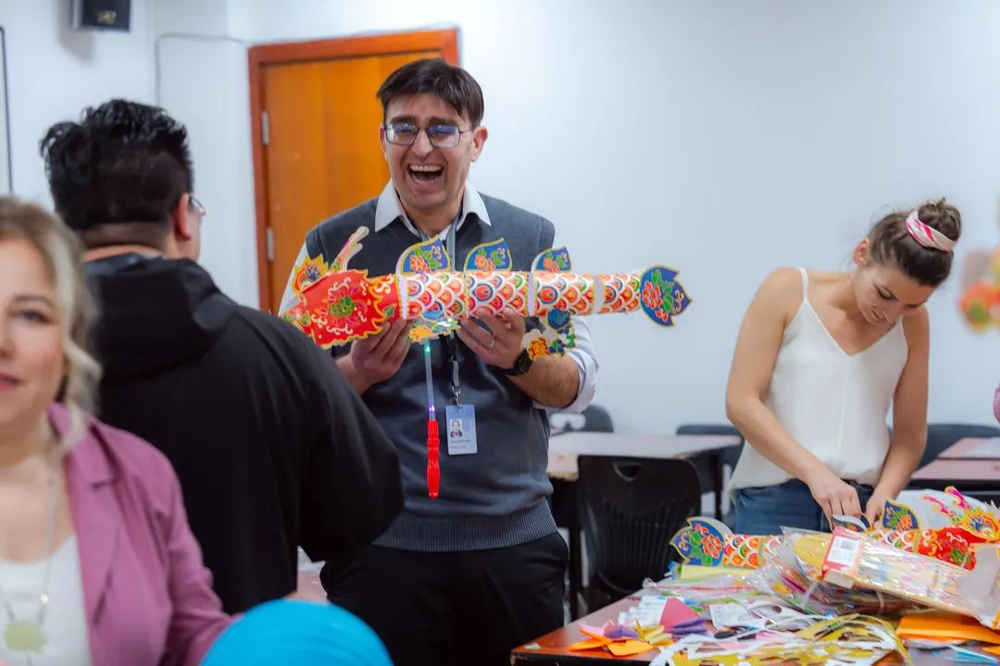

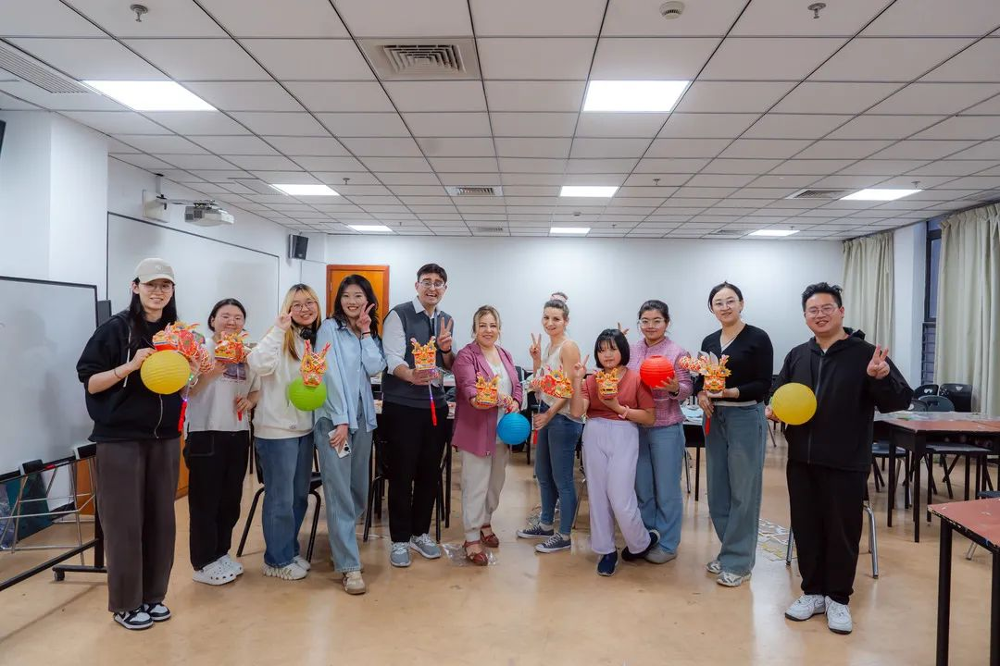

## 4. Art Workshop Series: Vocal Music

**/Guest Speaker/**

**Mr. Lv Yaodong**

The vocal music section was a highlight of this workshop, immersing us in a sea of music. Under the guidance of **Mr. Lv Yaodong**, WKU's art festival provided an extraordinary vocal experience for all students and teachers!

During the event, Mr. Lv provided professional guidance, allowing students to fully express their imagination and showcase their unique artistic talents. Every note was full of infinite possibilities, and we look forward to the next art festival!

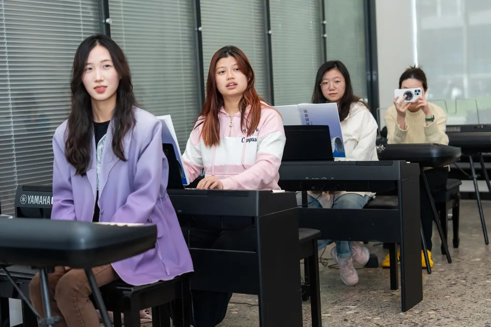

## 5. Art Workshop Series: Paper Cutting

**/Guest Speaker/**

**Mr. Zhou Shiwei**

Paper cutting is a unique artistic landscape in traditional Chinese culture. Every cut is a tribute to history and an expression of emotions about life.

In this workshop, **Mr. Zhou Shiwei** personally demonstrated paper cutting techniques, showing the beauty and charm of paper cutting. Participants created their own paper-cutting works, experiencing the joy and artistic process of paper cutting. Some of these works amazed us, reflecting the unique charm and artistic value of Chinese traditional culture. Each paper cutting was an artwork, deepening our respect and love for traditional culture.

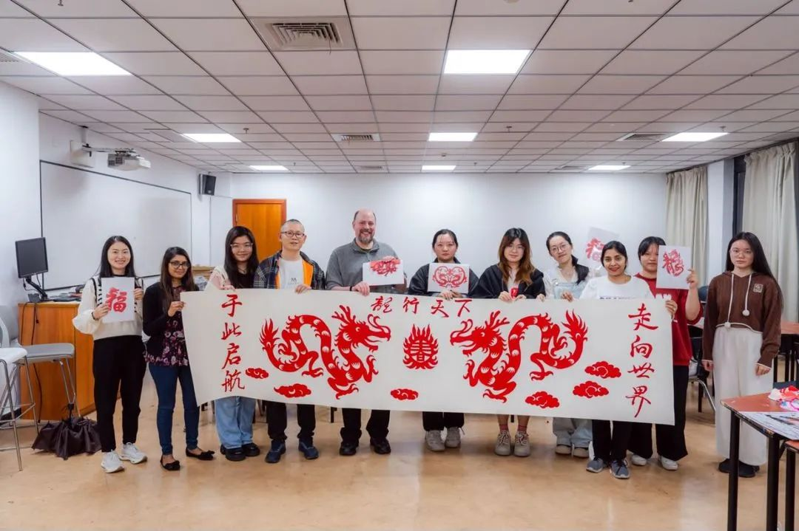

Every artist brought us a unique and valuable perspective, allowing us to understand the diversity and beauty of art more deeply.

Thank you to all the participants for your enthusiasm and dedication. It is your hard work that made this wonderful event possible.

Let us continue to enrich our campus life through art, and may our artistic journey never end. May the WKU giant ship sail towards an even brighter shore!
