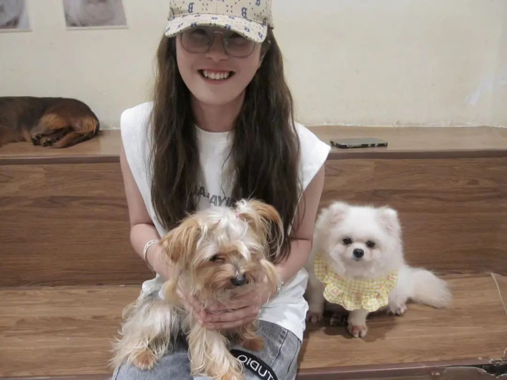
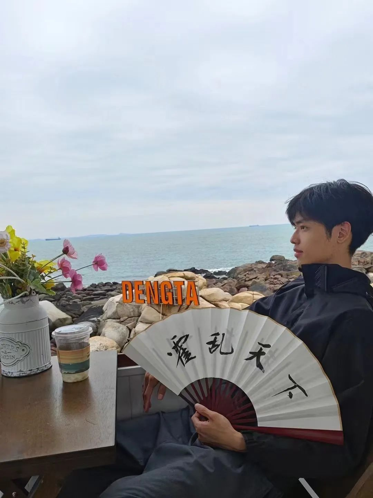
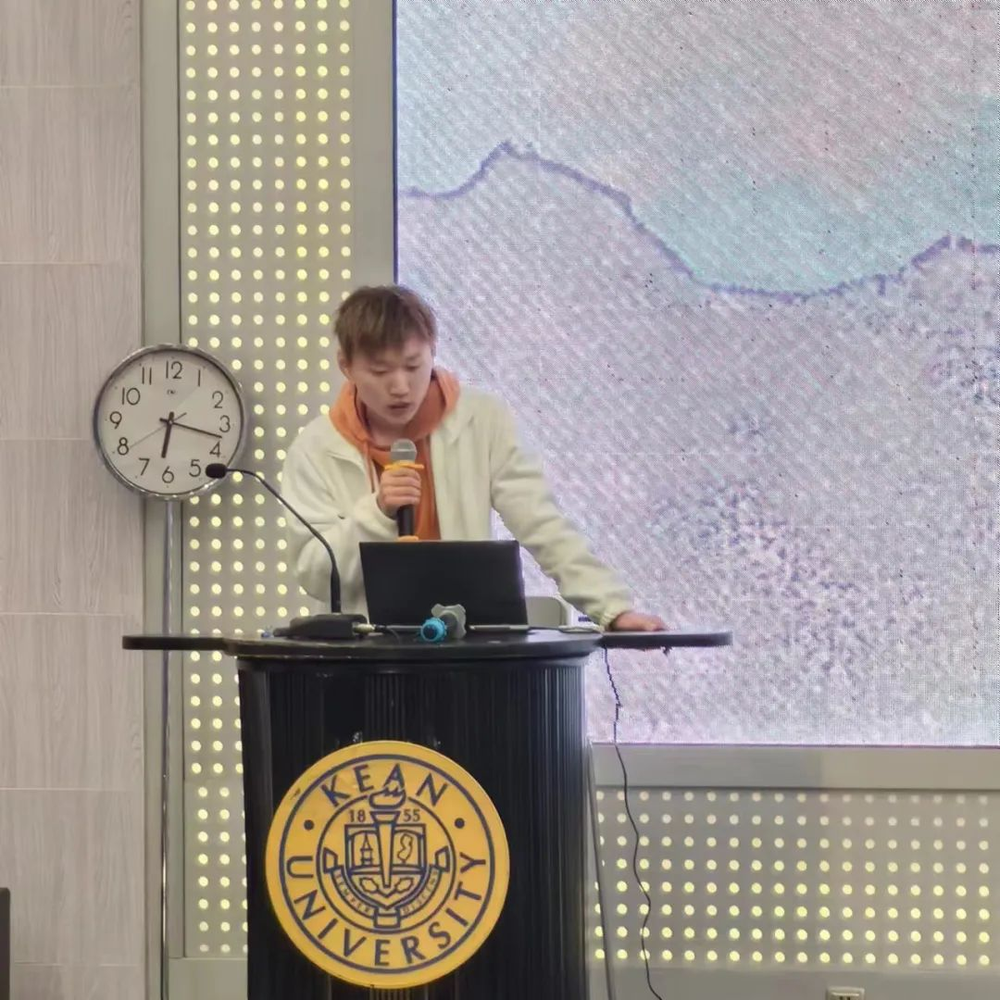

# Psy Club Detail

## Main Departments

### Activity Department

Responsible for planning and organizing activities.

### Publicity Department

Divided into copywriting, layout, and photography.

### Finance Department

Responsible for procurement and reimbursement.

## Main Department Responsibilities

### Activity Department

- **Planning**: Responsible for proposing activity projects, planning activity schemes, and creating theme ideas.
- **Organization**: Responsible for organizing personnel and arranging venues, including collecting and managing props, controlling on-site order, supervising activity preparation and progress, and gathering opinions and suggestions from other departments.

### Publicity Department

- **Copywriting**: Responsible for writing articles, presentation scripts, and emails.
- **Layout**: Responsible for creating and managing PsyClub peripheral products, producing promotional posters and videos.
- **Photography**: Taking photos and videos.

### Finance Department

- **Procurement**: Responsible for purchasing and renting materials and equipment needed for activities.
- **Reimbursement**: Responsible for financial record-keeping and management, coordinating with other departments on financial matters, and liaising with relevant school departments for bill verification and reimbursement.

## Main Leaders

### President Ma Xinlei

Waiting for the cicadas' call at the end of summer, welcoming our four seasons.

Follow the light, we are together.

### Vice President Chen Ying

Scorpio, a person who embodies both romanticism and realism.

### Activity Department Head Lin Mingguang

Attention new students coming to WKU: The PsyClub you are looking for is now recruiting new members!

### Activity Department Deputy Head Chen Jinjian

I hope everyone can make good friends here and have fun.

### Publicity Department Head Zhang Yunhe

"Welcome, friends of PsyClub. This is a love letter waiting for you to unfold, with the pen held by all of us with love!"

### Publicity Department Deputy Head Weng Nuan

Life is boundlessly beautiful, not just today, not just summer, regardless of reciprocation, without limitations.

May your path ahead be filled with blooming flowers, and all your aspirations come true~

### Finance Department Head Zhou Kehao

Hello everyone, I am Zhou Kehao, the head of the Finance Department. I am very happy to meet everyone in PsyClub. I hope the club can enrich your life and bring beautiful memories!

"We must grow brightly, embrace passionately, let the intensity of midsummer, the fire of autumn, and the tide of spring carry us forward to our next season of brightness and prosperity."

Here, we witness the rise of a new generation of power. We look forward to everyone continuing the PsyClub spirit, illuminating the path of the soul, and contributing to mental health together!
