# PsyClub | Autumn Collage Poetry Activity Review
WKU PsyClub  2024-11-12 21:02

Autumn Collage Poetry

||||||||  Start the beauty of autumn   ||||||||

2024.11

Psy

poetry

Our autumn collage poetry activity has successfully concluded! 🎉📜 In this golden season,  
we used words together to  
piece together the romance and depth of autumn

**「 RECALLING 」**

**PART 1**

**Activity Highlights**

In this activity, we not only collected countless creative collage poetry works  
but also witnessed everyone's love for poetry and talent.  
Each poem is like a fallen leaf,  
gently drifting to the lake of our hearts, creating ripples.

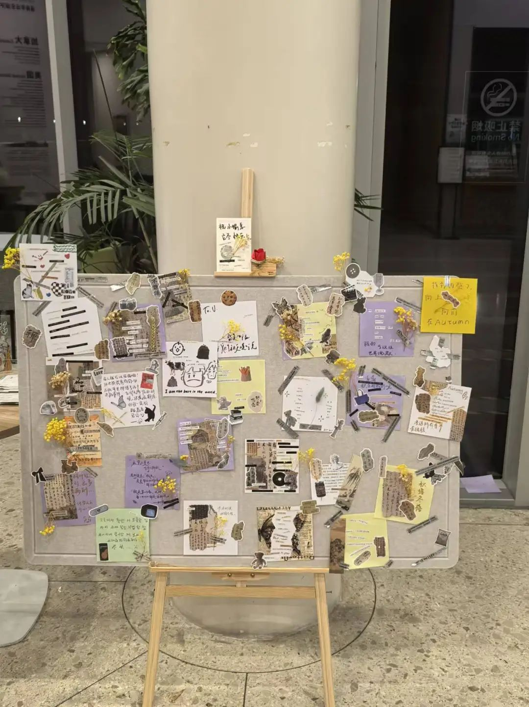

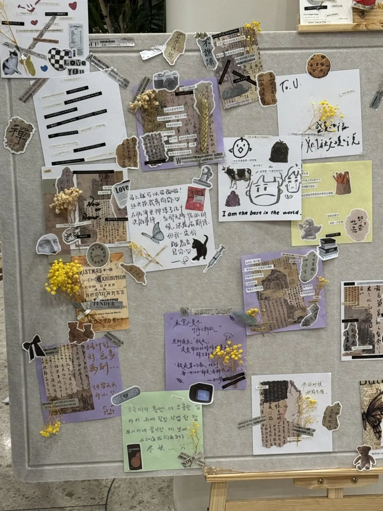

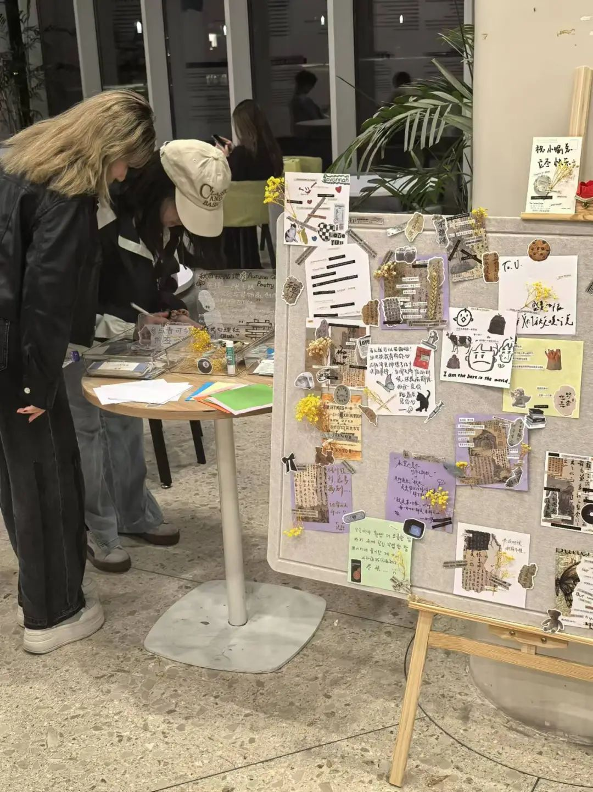

**PART 2**

**Masterpiece Appreciation**

Through everyone's voting,  
we selected some of the  
most creative and emotionally resonant collage poetry works.  
They are either heartwarming or thought-provoking.  
Each poem is a story,  
a dream, an imprint of autumn.

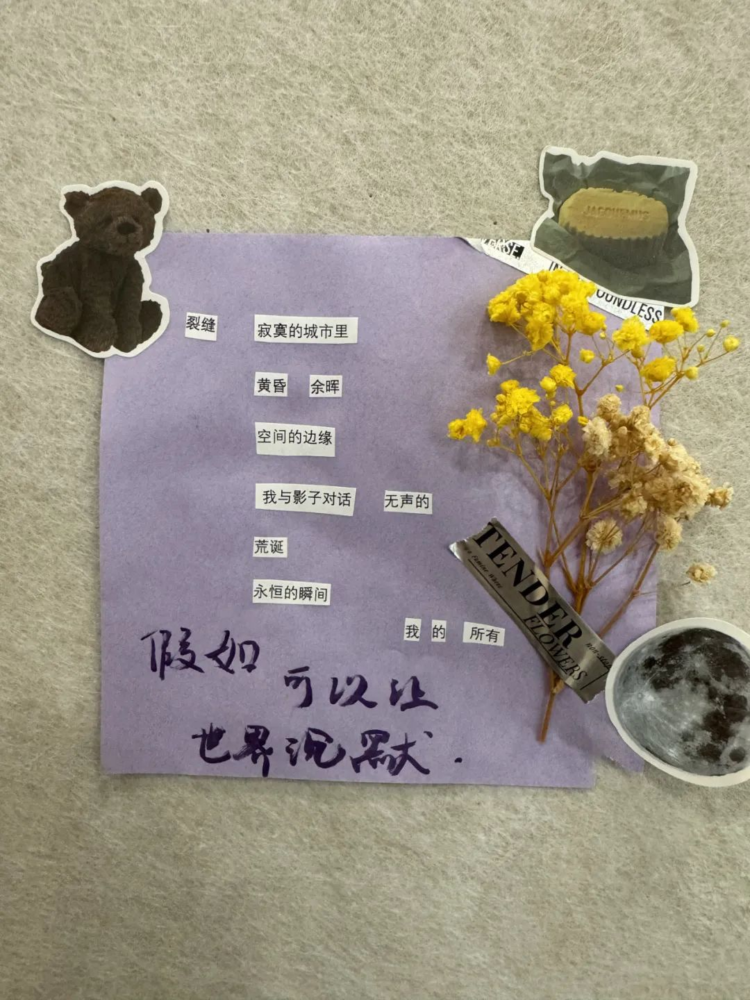

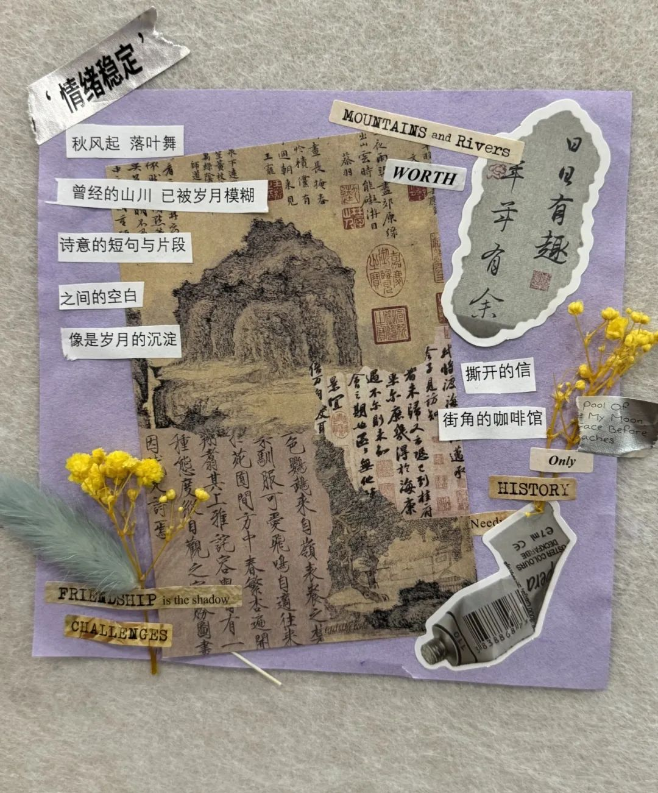

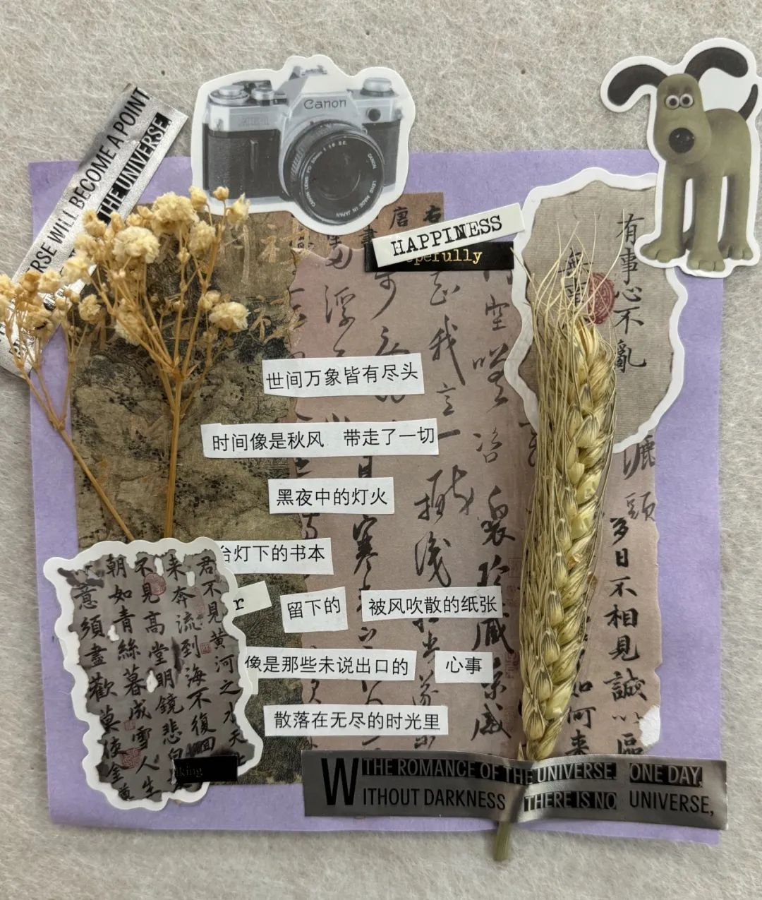

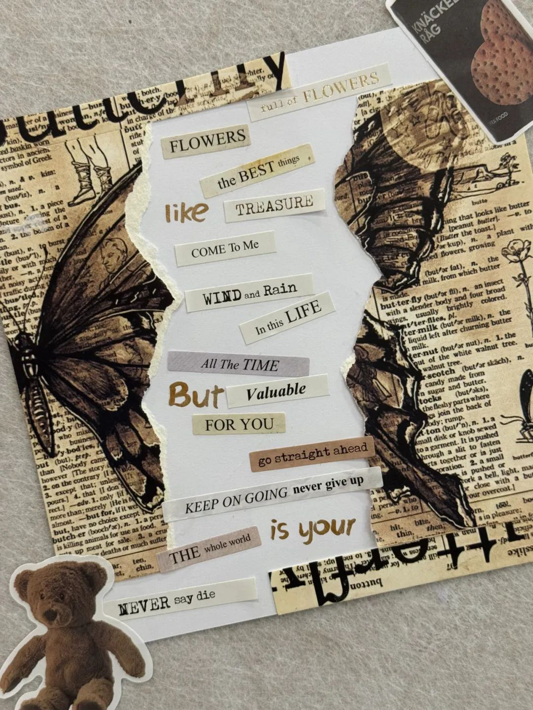

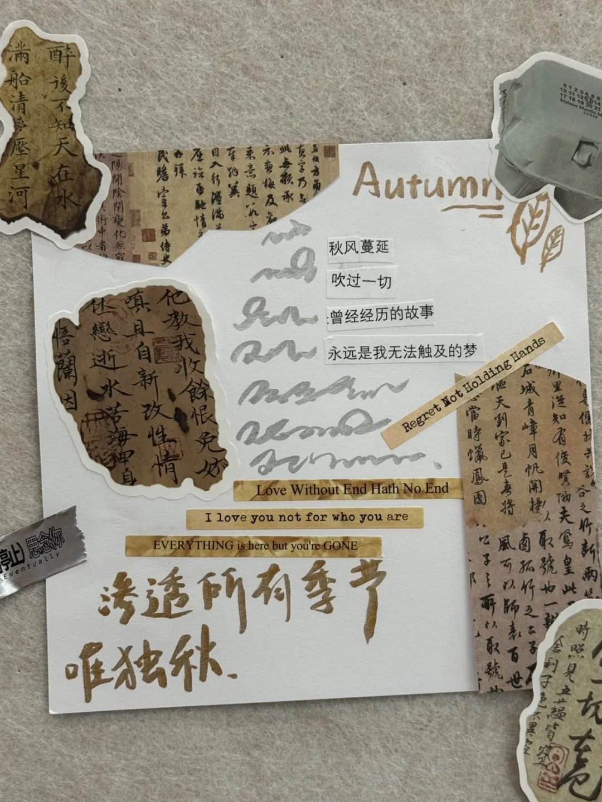

**PART 3**

Participants also shared their creative experiences and unique insights on poetry. These shares make us believe even more that poetry is a bridge that connects hearts and a window to express emotions.

Although the activity has ended, the journey of poetry will never stop. We look forward to exploring more poetic possibilities with everyone in the future, continuing to roam in the world of words.

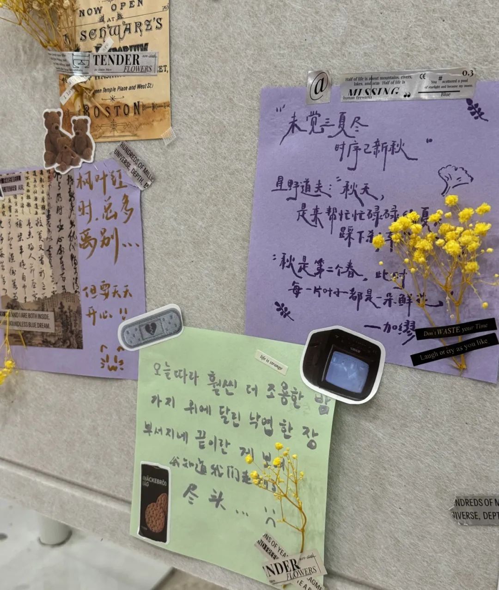

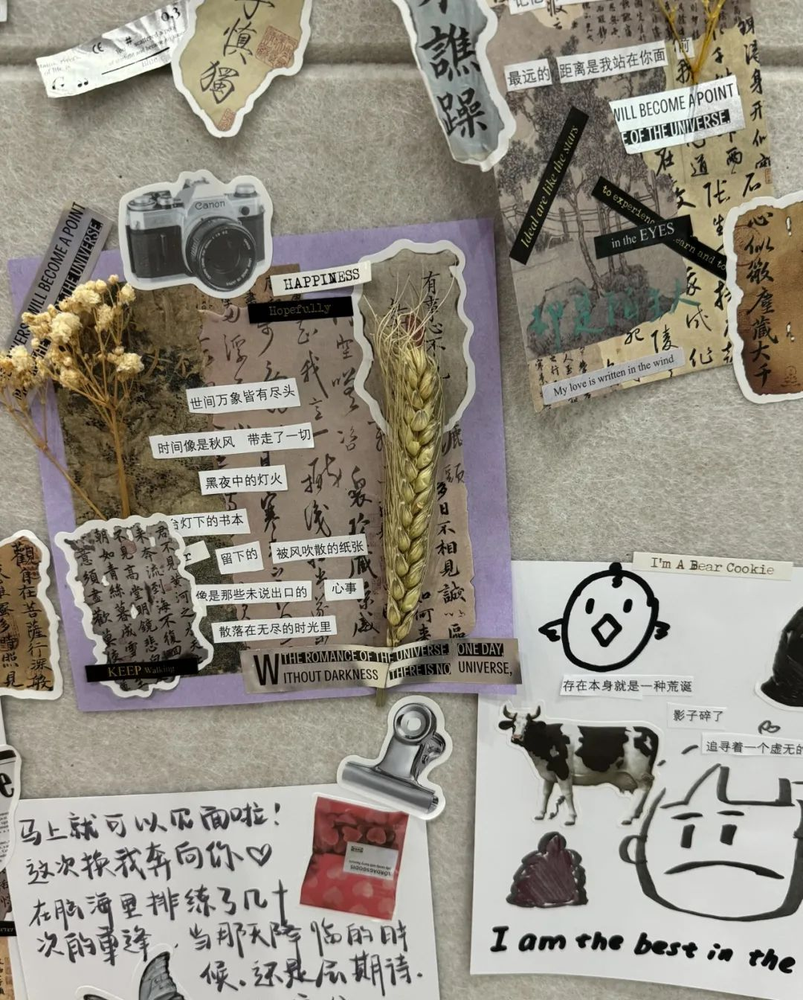

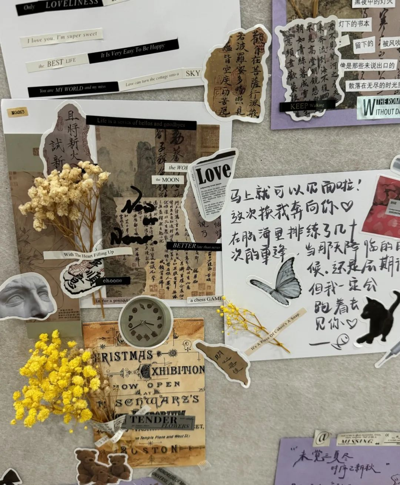

2024..11

Text: Liu Ziqian  
Layout: Liu Ziqian  
Review: Ma Xinlei, Zhang Yunhe, Weng Nuan