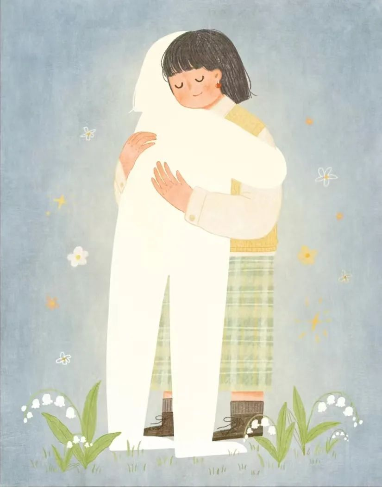
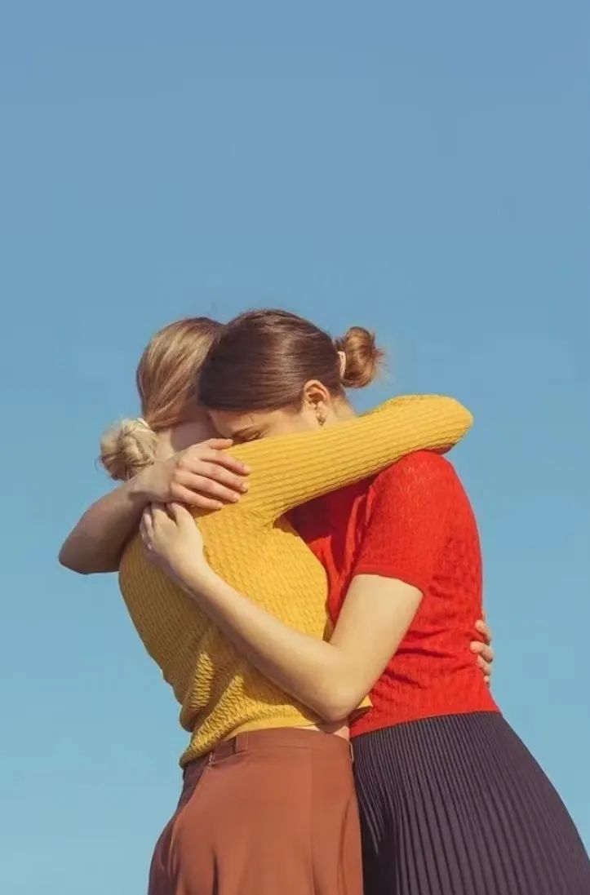
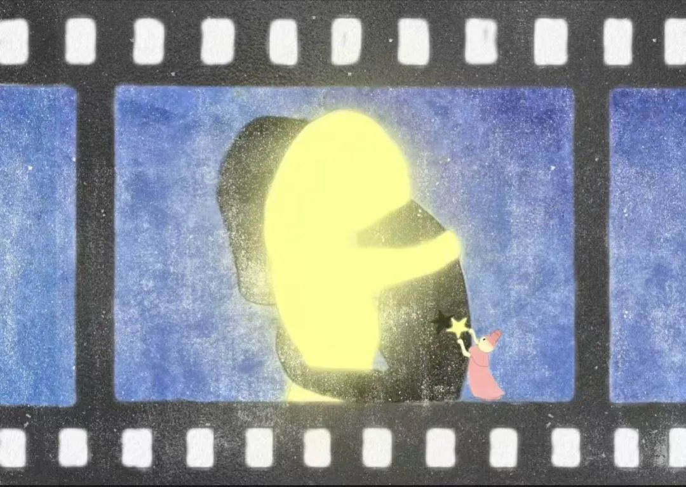
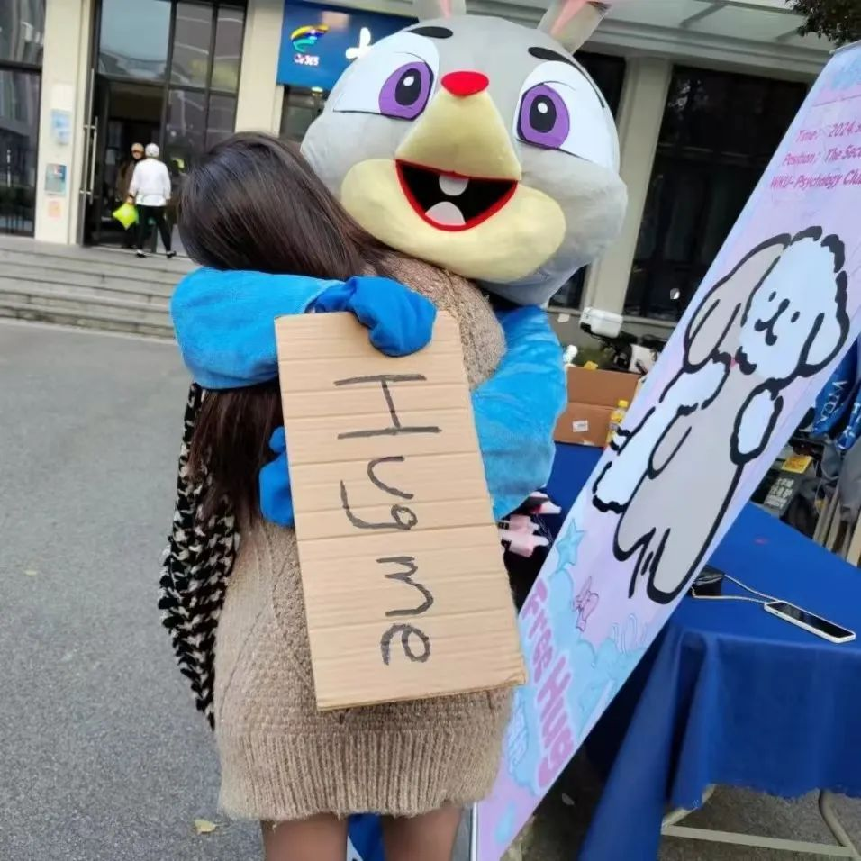
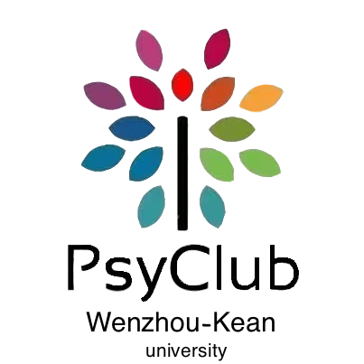

# PsyClub | Free Hug
WKU PsyClub  2024-11-15 16:35

**FREE HUG**

Do you want a free hug?

**WE WANT A BIG HUG**

The reason for longing for a hug is simple,  
we are human,  
and the heart is a sensitive muscle.

— Jón Kalman Stefánsson, *Fish Have No Feet*

The tremendous pressure of study and life often leaves us breathless;  
Emotional communication and relationship maintenance between people are often neglected.

In modern society, the fast-paced lifestyle and highly digitalized means of communication often lead to increased emotional distance between people. Many people neglect emotional communication and relationship maintenance amidst busy work and study. This not only makes individuals feel lonely but also reduces emotional communication between people, affecting the warmth and cohesion of society.

**What you need at this moment may be a hug.**

HUG HUG

**A hug can relieve 120% of stress**

A hug is a simple way to build a connection between people, an act of giving and receiving, a silent yet powerful language. Without words, a hug can convey emotional support accurately.

**0****1**

Generates dopamine, brings happiness

Dopamine is the source of good emotions and motivation. From a psychological perspective, hugging can promote the release of dopamine, bringing joy and happiness.

**0****2**

Helps release serotonin and oxytocin, reduces stress

A 2015 study by Carnegie Mellon University found that frequent hugging with important people can have a stress-buffering effect, releasing oxytocin, reducing stress to one-third, and effectively relieving stress and stress-induced illnesses.

FREE HUG

How I wish I could find you before you go too far,  
before you fall to the other side of the world,  
give you a hug,  
and tell you,  
you are not broken.

— Pan Bolin, *I Didn't Plan to Explain My Sadness to You*

GIVE YOU A BIG BIG HUG

HUG ME HUG YOU

**PsyClub × FREE HUG**

PsyClub hopes to enhance warmth and interaction in society by holding the "**Free Hug**" event, spreading care. Through hugs, we help you feel the genuine care of others, relieve stress and anxiety.

Whether you are facing homesickness or the pressure of studies and exams, you can fully release it by hugging our **mystery giant plush doll**. In the warm embrace of the doll, we hope you can forget sadness and pressure, gain emotional support, and new motivation.

This event will be held by volunteers wearing plush costumes, waiting for students to hug in front of the second cafeteria. Participants of the Free Hug can receive **small gifts** prepared by the PsyClub!

FREE HUG

We look forward to inward growth together during the process of self-healing.

Hug, and let love and warmth fill every moment!

DO YOU WANT A FREE HUG

**Event Time:**  
**November 30th, 12:45 - 18:45 pm**

**Event Location: In front of the second cafeteria**

Text & Layout  
| Cheng Sijie

Review  
| Ma Xinlei, Zhang Yunhe, Weng Nuan

Illustration  
| Little Pony Who Draws, White Paper Remembers Zhang

Images  
| Sourced from the Internet and on-site photography

