# PsyClub | Mandala Art Therapy
WKU PsyClub  2024-11-04 17:45

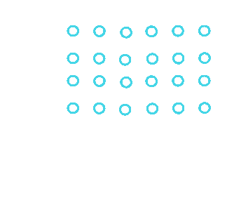

Mandala

PsyClub Mandala Healing Activity

Last weekend, we painted our inner mandalas together and experienced a unique journey of mental healing. Each piece was unique, just like the story of each participant's soul.

**Color and Harmony**

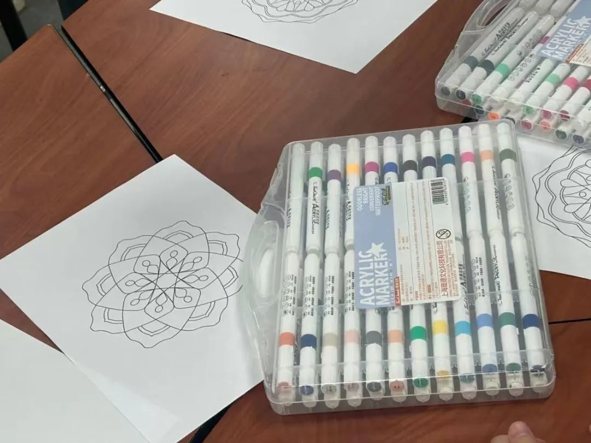

Amid the intertwining colors, we explored ourselves, released emotions, and found inner peace. The symmetrical mandala patterns became the focus of our meditation, guiding us into a state of deep relaxation.

**Meditation and Self-Discovery**

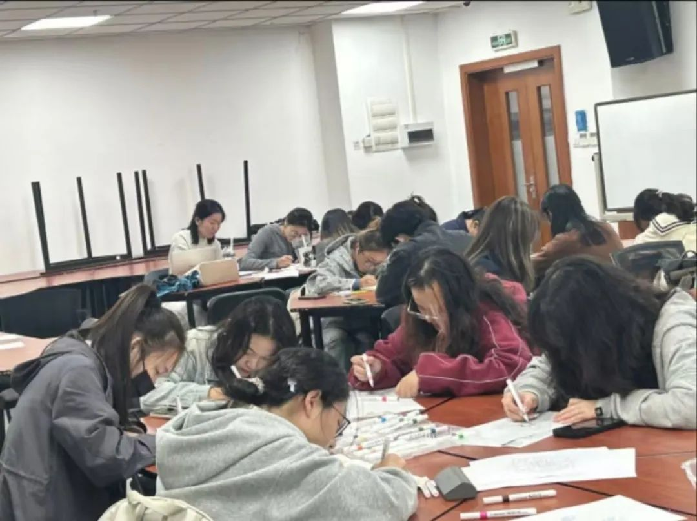

In a quiet atmosphere, we put aside the hustle and bustle of daily life, engaged in a deep inner journey through drawing, and had a meaningful self-dialogue.

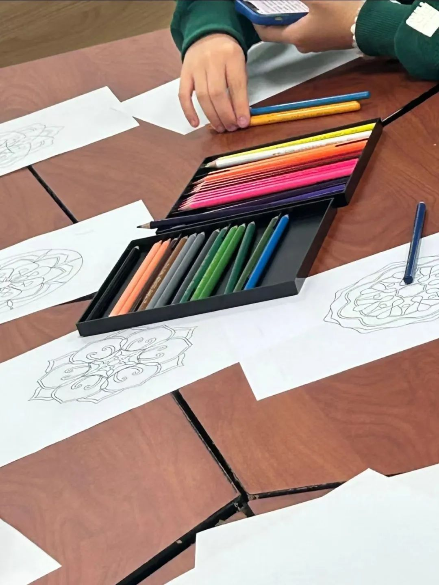

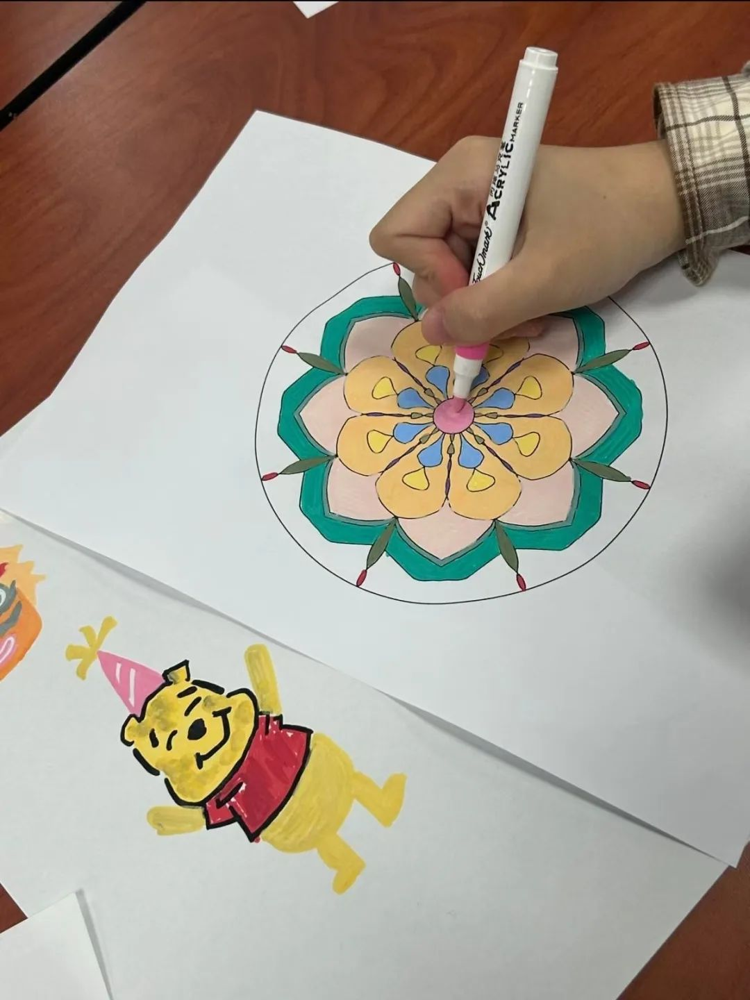

Exciting Moments

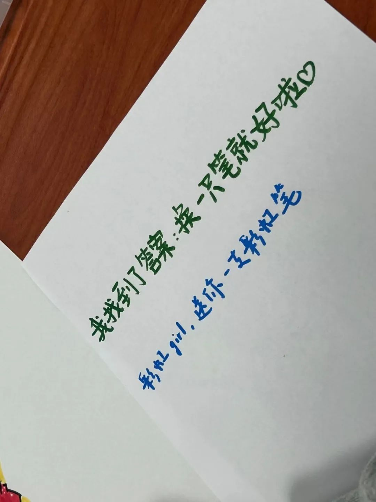

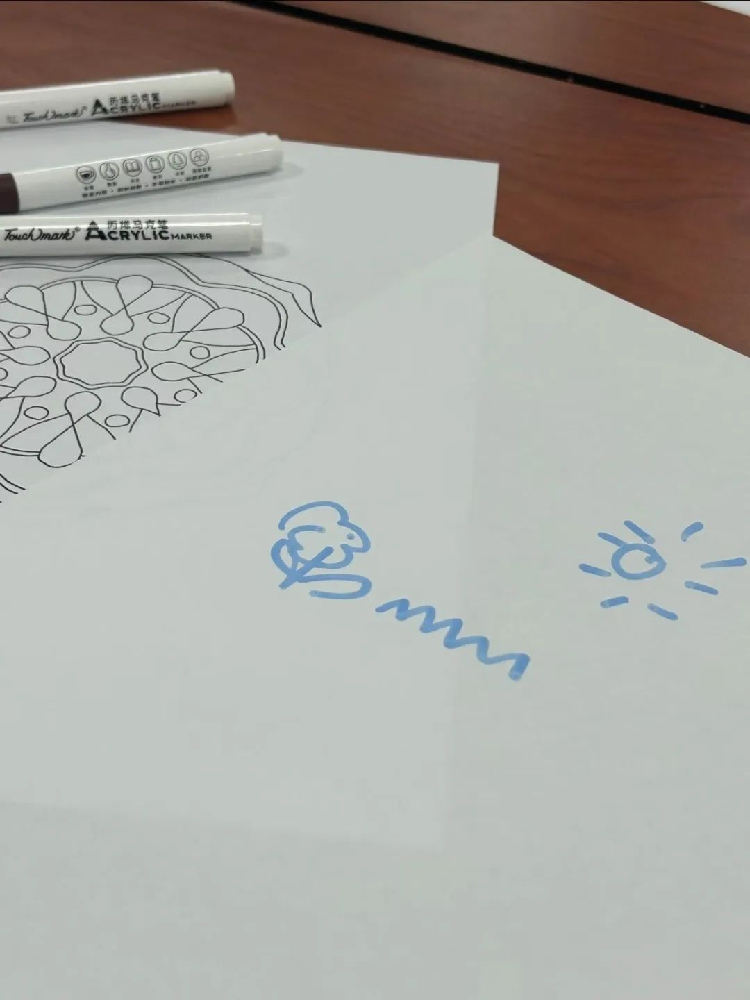

See how we created beautiful mandalas together and the unforgettable moments we shared

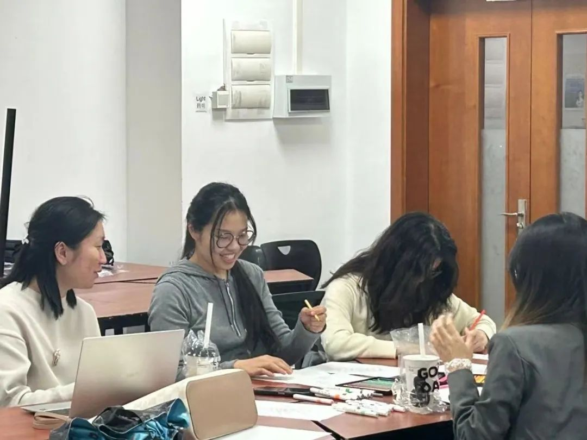

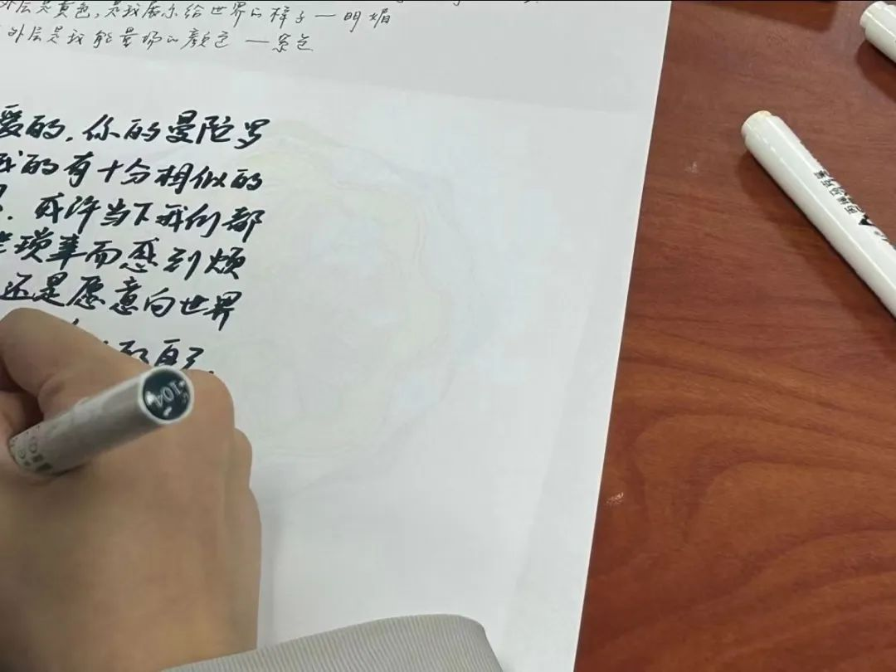

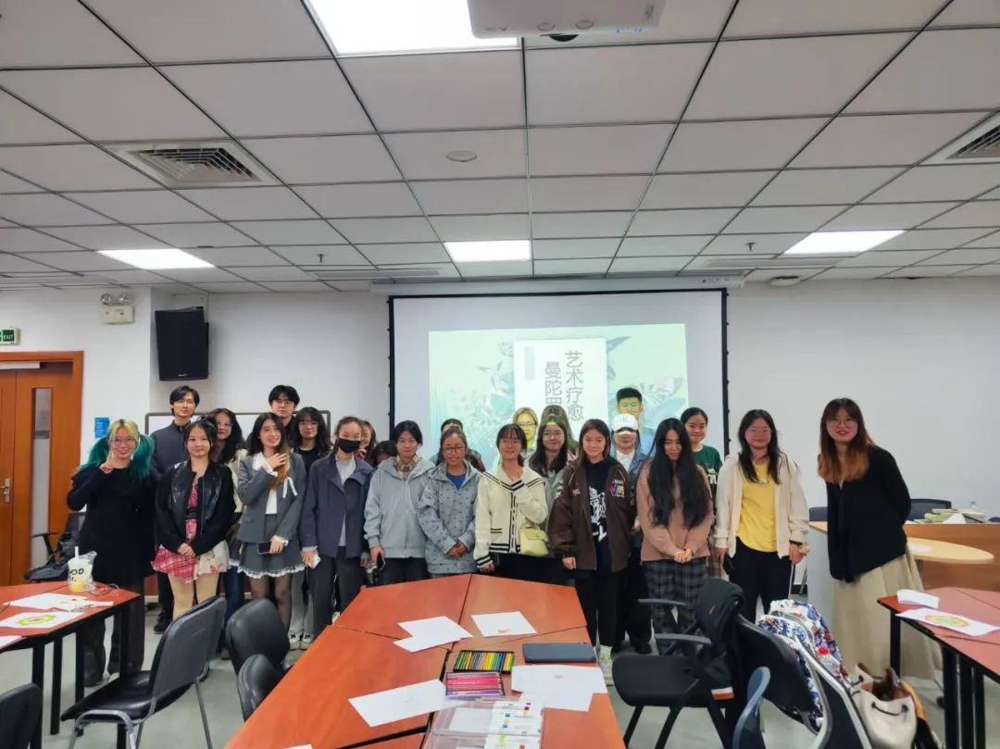

Images sourced from on-site photography

Want to know more about mandala art therapy or missed this event but want to join us on our next mental journey? Follow the PsyClub official account for more information!

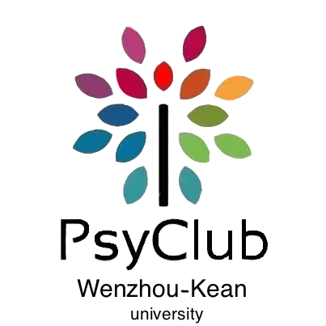

**Text | Huang Xinyi**

**Layout | Li Zimeng**

**Review | Ma Xinlei, Zhang Yunhe, Weng Nuan**

